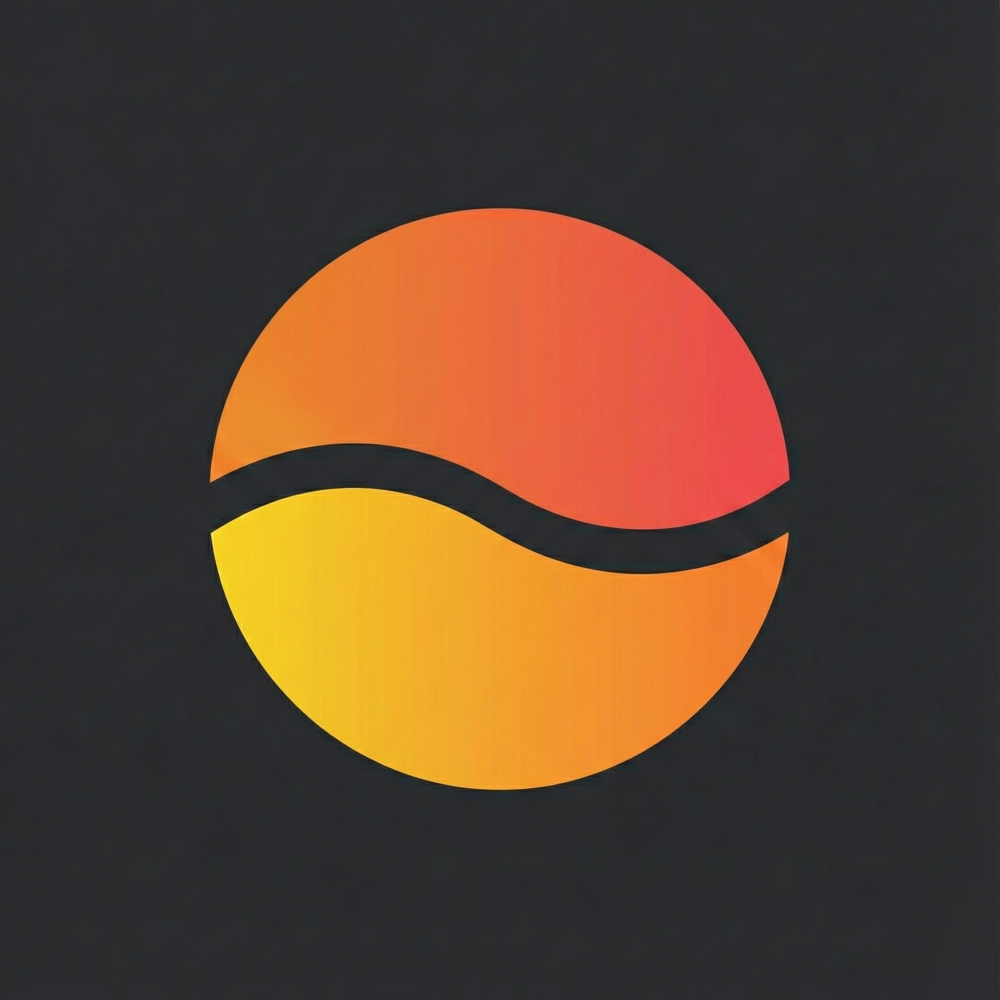
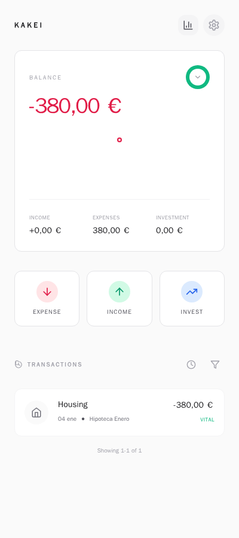
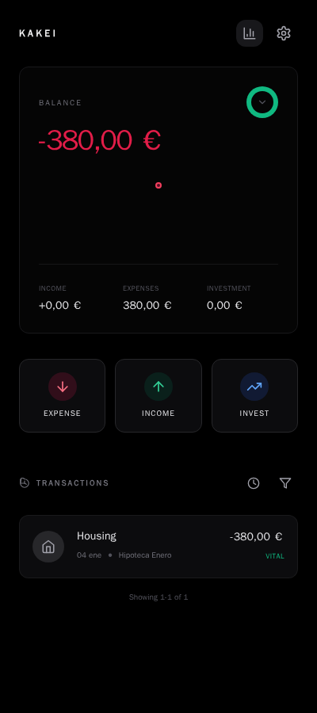
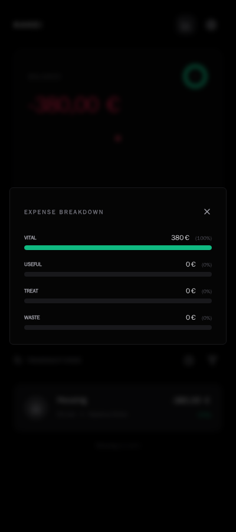
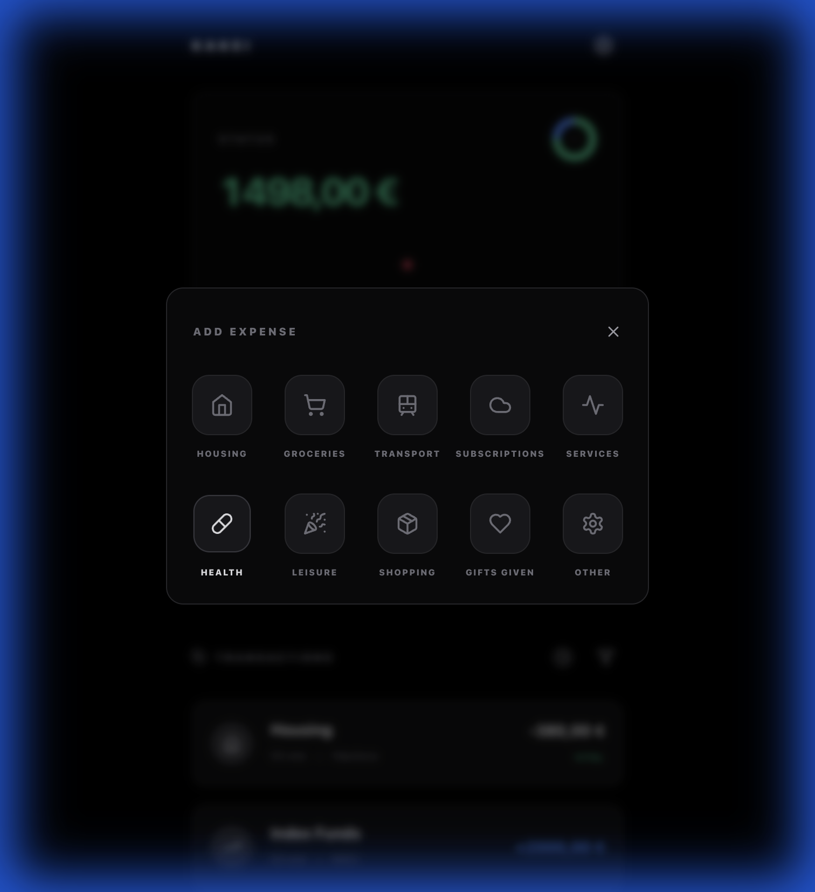
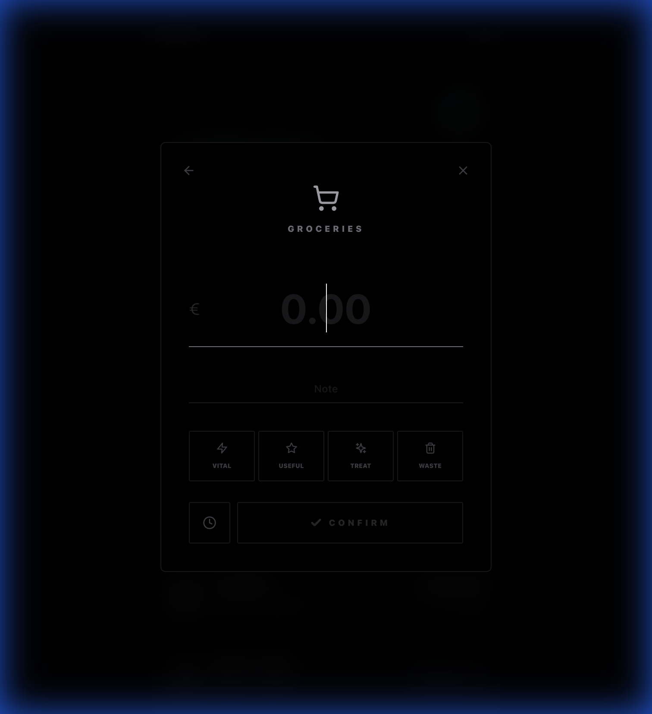
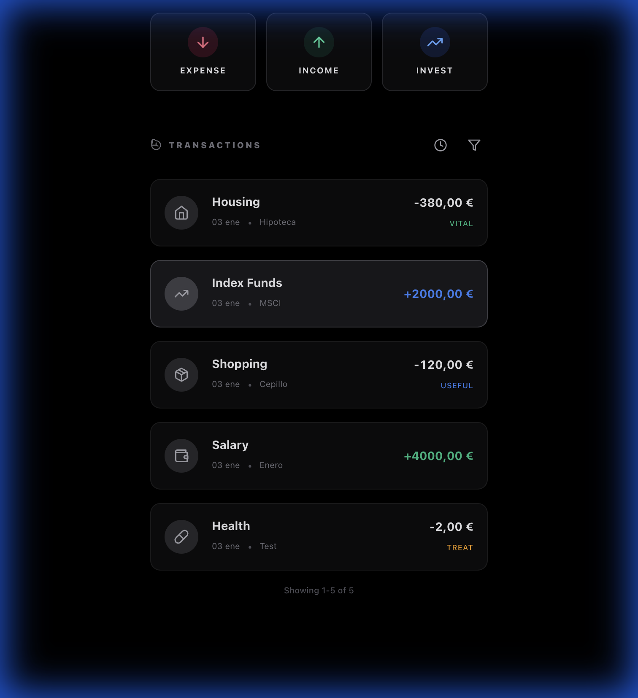

<div align="center">



# KAKEI (家計)

> **Philosophy**: Stoic. Minimalist. Frictionless.  
> *"Wealth consists not in having great possessions, but in having few wants."* — Epictetus

[](https://www.typescriptlang.org/)
[](https://reactjs.org/)
[](https://bun.sh)
[](https://elysiajs.com)
[](https://www.docker.com/)
[](https://www.gnu.org/licenses/agpl-3.0)

<a href="https://www.buymeacoffee.com/tofusito" target="_blank"></a>

</div>

---

**Kakei** is a personal finance tracker designed for the disciplined mind. It features a brutalist, OLED-optimized interface with **True Black** (`#000000`) and **Light Mode** themes, ensuring a friction-free experience for tracking Income, Expenses, and Investments.

## ✨ Features

### 🎨 **Elegant & Adaptive UI**
- **Dual Theme Support**: Toggle between **True Black** (OLED-optimized) and **Light Mode**. Theme preference is persisted automatically.
- **Internationalization (i18n)**: Fully localized in **English** 🇺🇸 and **Spanish** 🇪🇸.
- **Responsive Design**: Flawless experience on both mobile and desktop.
- **Smooth Animations**: Glassmorphism effects and delightful micro-interactions.

### 💸 **Transaction Management**
- **Frictionless Entry**: Large, accessible buttons for **Expense**, **Income**, and **Investment**.
- **Smart Categorization**: Visual grid with translated categories:
  - **Income**: Salary, Money Received, Sales, Investment Returns, Refunds
  - **Expenses**: Housing, Groceries, Transport, Subscriptions, Services, Health, Leisure, Shopping, Gifts, Other
  - **Investments**: Index Funds, ETFs, Savings
- **Edit & Delete**: Full control over your history with inline editing and pagination (10 items per page).
- **Date Selection**: Backdate transactions with a built-in date picker.
- **Classification**: Categorize expenses by necessity:
  - 🟢 **Vital**: Survival needs
  - 🔵 **Useful**: Quality of life
  - 🟡 **Treat**: Pleasures
  - 🔴 **Waste**: Regrettable spending

### 📊 **Visual Dashboard**
- **Real-time Balance**: Instant overview of your financial health.
- **Expense Ring**: Interactive donut chart showing spending distribution by classification.
- **Advanced Filtering**: Filter transactions by:
  - **Time Period**: All Time, This Week, This Month, This Year
  - **Expense Type**: Vital, Useful, Treat, Waste
- **Pagination**: Efficient browsing with 10 transactions per page.

### 📱 **Progressive Web App (PWA)**
- **Install on Mobile**: Add to home screen on iOS/Android for a native-like experience.
- **Custom Icon**: Beautiful gradient circular logo appears on your device's home screen.
- **Offline-Ready**: Works seamlessly without an internet connection.
- **No App Store Required**: Instant access directly from your browser.
- **Native-Like Experience**: Fullscreen mode without browser chrome.

### 🔒 **Security & Privacy**
- **JWT Authentication**: Secure login with HTTPOnly cookies and rate limiting (5 attempts/minute).
- **Protected Routes**: All API endpoints require authentication.
- **⚠️ Required Configuration**: Must create `.env` file from `.env.example` before deployment.
- **Configurable Credentials**: Set your own username/password via environment variables.
- **Session Persistence**: Login lasts 7 days, no need to re-authenticate on page reload.
- **Production-Ready**: Designed for safe deployment via Cloudflare Tunnel or reverse proxy.
- **Self-Hosted**: Your data lives on your machine.
- **No Tracking**: Zero analytics, zero telemetry.
- **Dockerized**: Single-container deployment with persistent storage.

---

### � Visual Dashboard
<div align="center">
  
  
</div>

### � Expense Breakdown
<div align="center">
  
</div>

### �💸 Frictionless Entry
<div align="center">
  
  
</div>

### 🔍 Detailed History
<div align="center">
  
</div>

---

## 🚀 Quick Start

### Prerequisites
- Docker & Docker Compose
- Git

### Installation

#### **Step 1: Clone the Repository**
```bash
git clone https://github.com/yourusername/kakei.git
cd kakei
```

#### **Step 2: ⚠️ Configure Environment Variables (REQUIRED)**

**You MUST create a `.env` file before starting the application.**

```bash
# Copy the example file
cp .env.example .env

# Generate a secure JWT secret
openssl rand -base64 32

# Edit .env with your favorite editor
nano .env  # or vim .env
```

**Update these values in `.env`:**
- `KAKEI_USER` - Your login username (change from "admin")
- `KAKEI_PASSWORD` - A strong password (minimum 12 characters)
- `JWT_SECRET` - The generated secret from `openssl rand -base64 32`

**Example `.env` file:**
```env
KAKEI_USER=myusername
KAKEI_PASSWORD=MySecureP@ssw0rd2024!
JWT_SECRET=esTIsZI/V47yJgkIyhHXq8jnJ1d6cEjUzQ4yOlQKUP0=
NODE_ENV=production
```

> 📖 **For detailed security guidelines, see [SECURITY.md](./SECURITY.md)**

#### **Step 3: Start the Application**
```bash
docker-compose up -d --build
```

#### **Step 4: Access Kakei**
```
http://localhost:3000
```

Login with the credentials you set in your `.env` file.

> **✅ Session Management**: Your login session persists for **7 days**. You won't need to login again when reloading the page or reopening your browser (unless you explicitly logout or 7 days pass).

> **💾 Data Persistence**: Database migrations and seeding run automatically on startup. All your data persists in a Docker volume (`kakei_data`) and survives container restarts.

### Stopping the Application

```bash
docker-compose down
```

To remove all data (including the database):
```bash
docker-compose down -v
```

### 📱 Installing as a Web App (PWA)

#### iOS (Safari)
1. Open `http://localhost:3000` (or your server's IP) in Safari
2. Tap the **Share** button (square with arrow)
3. Scroll down and select **"Add to Home Screen"**
4. Confirm and enjoy the native-like experience with the beautiful circular gradient icon!

#### Android (Chrome)
1. Open `http://localhost:3000` in Chrome
2. Tap the **menu** (three dots)
3. Select **"Add to Home screen"**
4. Confirm and launch from your home screen

#### Desktop (Chrome/Edge)
1. Open `http://localhost:3000`
2. Click the **install icon** (➕) in the address bar
3. Click **"Install"** and it will open as a standalone app

---

## 🛠️ Tech Stack

### Runtime & Framework
- **[Bun](https://bun.sh)**: Ultra-fast JavaScript runtime.
- **[ElysiaJS](https://elysiajs.com)**: High-performance backend framework.

### Frontend
- **React 18**: Component-based UI.
- **Vite**: Next-generation frontend tooling.
- **TailwindCSS**: Utility-first styling.
- **Lucide Icons**: Crisp, consistent iconography.
- **i18next**: Robust internationalization framework.

### Backend & Database
- **PostgreSQL 15**: Reliable relational database.
- **Drizzle ORM**: TypeScript-first ORM for type safety.
- **Docker**: Containerization for consistent deployment.

---

## 🔧 Troubleshooting

### "Login Required on Every Page Reload"

**Problem**: Session doesn't persist, asks for login after refreshing.

**Solution**:
1. Verify `.env` file exists in project root
2. Check `NODE_ENV=production` is set in `.env`
3. Clear browser cookies and cache
4. Restart containers: `docker-compose down && docker-compose up -d`
5. Session should now persist for 7 days

### "Cannot Connect to Database"

**Problem**: Backend can't reach PostgreSQL.

**Solution**:
```bash
# Check containers are running
docker-compose ps

# View logs
docker-compose logs db
docker-compose logs app

# Restart with fresh build
docker-compose down && docker-compose up --build -d
```

### "Invalid Credentials" (Rate Limited)

**Problem**: Too many failed login attempts.

**Solution**: Wait 1 minute. Rate limit is 5 attempts per minute per IP.

---

## 🤝 Contributing

Contributions are welcome!

1. Fork the repository
2. Create your feature branch (`git checkout -b feature/AmazingFeature`)
3. Commit your changes (`git commit -m 'Add some AmazingFeature'`)
4. Push to the branch (`git push origin feature/AmazingFeature`)
5. Open a Pull Request

---

## 📄 License

Distributed under the **AGPL-3.0** License. See `LICENSE` for more information.

---

<div align="center">

**Built with ❤️ and discipline**

*Track your wealth. Master your wants.*

</div>
